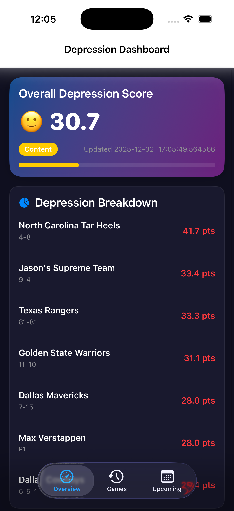
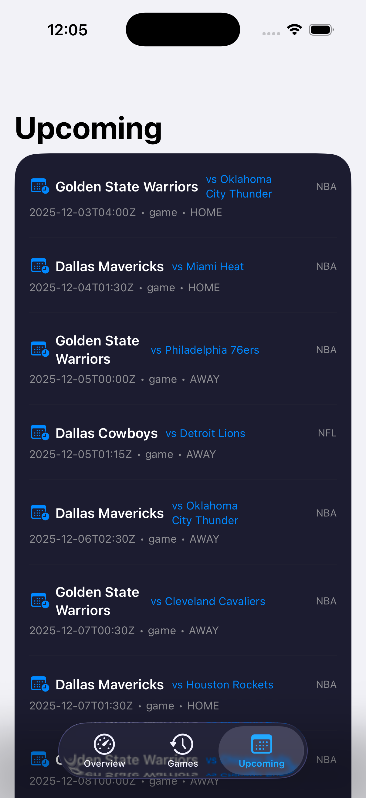

# Depression Dashboard iOS

Native iOS app for the Depression Dashboard, built with SwiftUI.

## Screenshots/Demo





## Key Features

- Overview dashboard with depression score and breakdown by team
- Recent games list with scores, opponents, and game details
- Upcoming events calendar with date and time information
- Pull-to-refresh functionality on all screens
- Dark theme UI matching the web dashboard
- Error handling and loading states

## Requirements

- iOS 15.0+
- Xcode 14.0+
- Swift 5.7+

## Setup

1. Clone this repository
2. Open `Depression-Dashboard-iOS.xcodeproj` in Xcode
3. Build and run on simulator or device

## API

The app connects to the Depression Dashboard API hosted on Railway:
- Base URL: `https://depression-dashboard-production.up.railway.app`
- Endpoints:
  - `GET /api/depression` - Get depression score and breakdown
  - `GET /api/recent-games` - Get recent game results
  - `GET /api/upcoming-events` - Get upcoming events
  - `POST /api/refresh` - Trigger data refresh

## Development

### Running Tests

```bash
# Unit tests
xcodebuild test -scheme Depression-Dashboard-iOS -destination 'platform=iOS Simulator,name=iPhone 15'

# UI tests
xcodebuild test -scheme Depression-Dashboard-iOS -destination 'platform=iOS Simulator,name=iPhone 15' -only-testing:Depression-Dashboard-iOSUITests
```

## Deployment

### TestFlight

1. Archive the app in Xcode
2. Upload to App Store Connect
3. Submit for TestFlight beta testing

### App Store

1. Follow TestFlight steps
2. Submit for App Store review

## Challenges Faced

- Swift concurrency and actor isolation issues resolved with proper Sendable types
- API integration requiring consistent data models between backend and iOS
- Date parsing across different formats and timezone handling
- UI/UX design to match web dashboard while maintaining native iOS feel

## Future Additions

- Push notifications for important game results
- Widget support for home screen
- Historical trend charts
- Offline mode with cached data
- Apple Watch companion app

## License

Same license as the main Depression Dashboard project.

